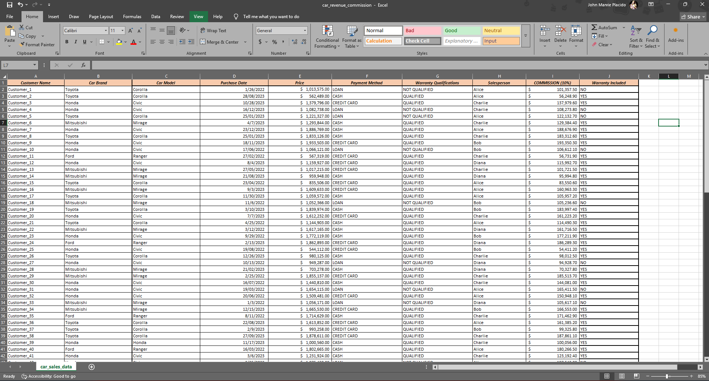

# Car Sales Data Cleaning & Analysis  

This project demonstrates the process of cleaning and transforming messy car sales data into a structured dataset with meaningful insights.  

## Project Overview  
- Cleaned messy data and corrected inconsistencies in **car brand** and **car model**.  
- Separated car brand and model into distinct columns for clarity and analysis.  
- Added **business logic conditions** using IF formulas:  
  - Warranty qualification → *LOAN = Not Qualified*, *CREDIT/CASH = Qualified*.  
  - Salesperson commission → 10% applied on each purchase.  
- Created new calculated fields:  
  - **Car Brand column** for grouped analysis.  
  - **Salesperson Commission column** to track incentives.  
- Added **Total Revenue** and **Total Commission** rows at the bottom for business insights.  
- Used multiple formulas to ensure data integrity and consistency.  

## Skills Demonstrated  
- **Excel Data Cleaning**: Standardizing inconsistent raw data.  
- **Formula Application**: IF logic, commission calculation, and totals.  
- **Business Rule Translation**: Turning company-like rules into formulas.  
- **Analytical Thinking**: Including salesperson commission and warranty logic for deeper insights.  
- **Data Structuring**: Preparing data for potential dashboards or further BI analysis.  

## 📷 Before the fix (Project Shot) 

## 📷 After the fix (Project Shot) 

